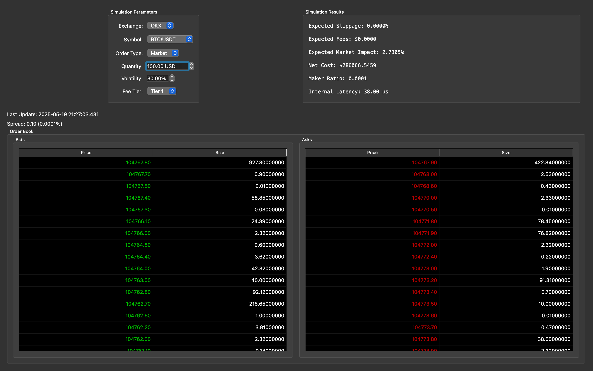

# Crypto Exchange Simulator


This project is a cryptocurrency exchange simulator that provides real-time order book data and trading functionality. It combines both C++ components with CMake build ecosystem to create a robust, minimum-latency trading platform & supports graphical user interface 



## Features
- Real-time Level 2 (L2) order book data streaming
- SSL Secure WebSocket connection to cryptocurrency exchange
- Realtime Processor: Expected Slippage, Fees, Market Impact, Net Cost, Maker/Taker Proportion 
- Quant Models:
    - Linear/Quantile Regression
    - Almgren Chriss Model 
    - Logistic Regression
- Interactive GUI for order book visualization 
- Latency Reporting
- Real-time Simulation 
- Asynchronous & Thread Safe data processing
- Comprehensive testing suite
- Lock Free message queues 
- Highly optimized Memory & Network management.
- Error Handling & Logging


## Tech Stack 
### Backend
- **C++17**: Core application logic
- **Qt6**: GUI framework
- **WebSockets**: Real-time data streaming
- **OpenSSL**: Secure communication
- **Boost**: C++ libraries for networking and utilities
- **nlohmann_json**: JSON parsing and handling
- **spdlog**: Logging system
- **GTest**: Unit testing framework
- **Eigen3**: Statistical methods for Models

### Development Tools
- **CMake**: Build system
- **Git**: Version control
- **VSCode**: IDE support

## Setup & Installation Instructions

### Prerequisites
- CMake (version 3.10 or higher)
- C++17 compatible compiler
- Qt6
- OpenSSL
- Boost
- GTest
- nlohmann_json
- spdlog

### Installation Steps

1. **Navigate to the repository**
   ```bash
   cd <-DIR NAME-(crypto_exchange_simulator)->
   ```

2. **Build the C++ project**
   ```bash
   mkdir build
   cd build
   cmake .. && make
   ```

3. **Run the application**
   ```bash
   # From the build directory
   ./crypto_exchange_simulator
   ```

4. **Test the application**
   ```bash
   # From the build directory
   ./tests/run_tests
   ```

### Configuration
- The application uses `config.json` for configuration settings
- WebSocket URL and other parameters can be modified in the configuration file


## Project Structure
```
.
├── src/            # C++ source files
├── include/        # C++ header files
├── tests/          # Test files
├── third_party/    # Third-party dependencies
├── static/         # static media files 
├── CMakeLists.txt  # CMake configuration
└── config.json     # Application configuration
```


## Author
- Github - [vansh2308](https://github.com/vansh2308)
- Website - [Vansh Agarwal](https://portfolio-website-self-xi.vercel.app/)
